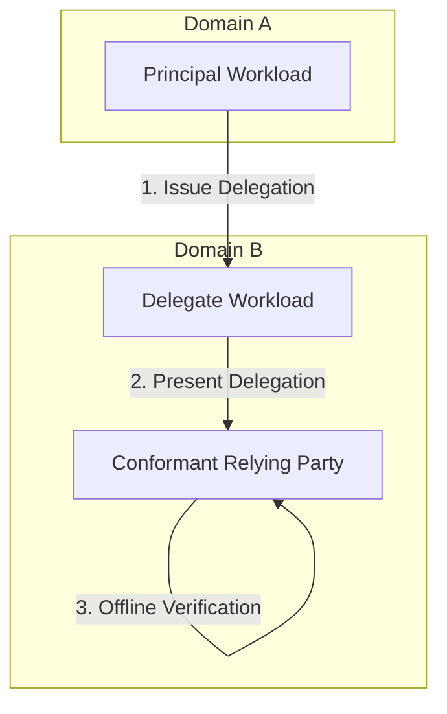

# System Architecture — Atlas

The Atlas architecture has two main components:
1.  **The System Under Test (workload delegation protocol):** The core security and identity primitive defined in the architecture RFCs.
2.  **The Reasoning Framework (`agents/`):** The system of epistemologies and knowledge anchors used to evaluate problems and decisions.

---

## 1. Workload Delegation System (The Protocol)

The delegation system is a protocol-level security layer designed to enable cross-domain delegation of workload authorities without relying on a shared runtime authority.



### System Boundaries

#### Inside the Boundary
*   **Delegation Issuance:** Enforces that a principal's delegation scope is a subset of its active permissions (`scope ⊆ permissions`).
*   **Delegation Record Production:** Emits tamper-evident, reconstruction-sufficient records.
*   **Offline Verification:** The verification logic runs entirely at the Relying Party (RP) boundary without live calls to a centralized authority.
*   **Specific Revocation:** Allows revocation of individual delegation instances without restarting the workloads, subject to a latency parameter `R` and partition state.
*   **Honest Degradation:** Behaviors when the relying party is partitioned from the revocation source are defined and handled transparently.

#### Outside the Boundary
*   **Base Workload Identity Issuance:** Relies on existing external infrastructure (e.g. SPIFFE/SPIRE) to issue workload credentials.
*   **Identity Standard Modification:** Coexists with, and does not alter, existing workload identity standards.
*   **RP Grant Decisions:** The Relying Party decides independently whether to grant access; the system does not dictate policy.
*   **Non-Conformant Verifiers:** Guarantees are nullified if the Relying Party fails to perform conformant verification checks.
*   **Issuer Key Compromise & Replay Attacks:** Left unmitigated by the core protocol, handled as honest system limits.
*   **Multi-Domain Federation:** Bounded strictly to exactly two independent trust domains (Domain A and Domain B) under V1 scope.

### Trust Boundaries
1.  **Conformant-Verifier Boundary:** The line across which security guarantees hold.
2.  **Two-Domain Boundary:** The partition between Domain A and Domain B. No shared authority exists.
3.  **Partition Boundary (S4):** The network separation between the relying party and the revocation-information source.
4.  **Issuance Boundary:** The point where scope checking is enforced during token creation.

### Runtime Actors
*   **Principal:** The workload on whose behalf the delegate acts. Owns a permission set.
*   **Delegate:** The workload that presents the delegation to the relying party.
*   **Relying Party (RP):** The verifier that checks the presented delegation.

---

## 2. Reasoning Framework (The Agent Workspace)

The workspace uses a structured, multi-agent adversarial architecture to process and record strategic decisions.

```
/home/raj/Videos/atlas/
├── agents/
│   └── agents/                    Framework root
│       ├── council/               5 Council Seats (Epistemologies)
│       │   ├── empiricist.md      Evidence & Citations
│       │   ├── cartographer.md    Boundaries & Lens Drift
│       │   ├── red-team.md        Failure Modes & Risks
│       │   ├── economist.md       Incentives & Economics
│       │   └── operator.md        Practitioner & Adoption Fit
│       ├── domain/                4 Knowledge Anchors
│       │   ├── distributed-systems.md
│       │   ├── ai-ml-systems.md
│       │   ├── product-engineering.md
│       │   └── market-buyer.md
│       ├── working/               Dynamic specialists spawned on demand
│       └── journal/               Verbatim decisions and dissent log
```

### Framework Core Principles
*   **Role Separation:** Council members represent *epistemologies* (methods of finding truth), not business roles. This minimizes role-collision.
*   **Knowledge Anchors:** Static files containing verified domain-specific constraints.
*   **Auditable Memory:** The `journal/` stores every decision. Dissent and overrides are documented explicitly, ensuring the historical context is preserved across independent development sessions.

<!-- checkpoint: docs(problem-scoring-guidelines): improve problem scoring guidelines -->
